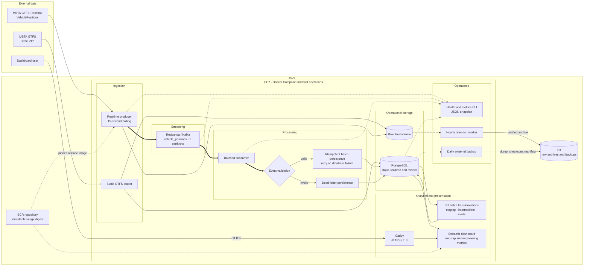
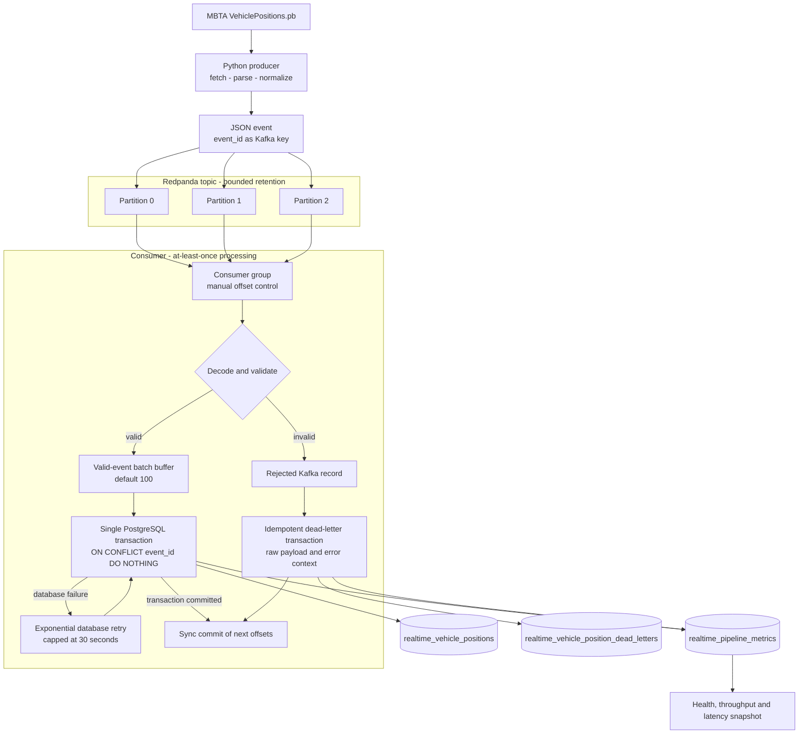
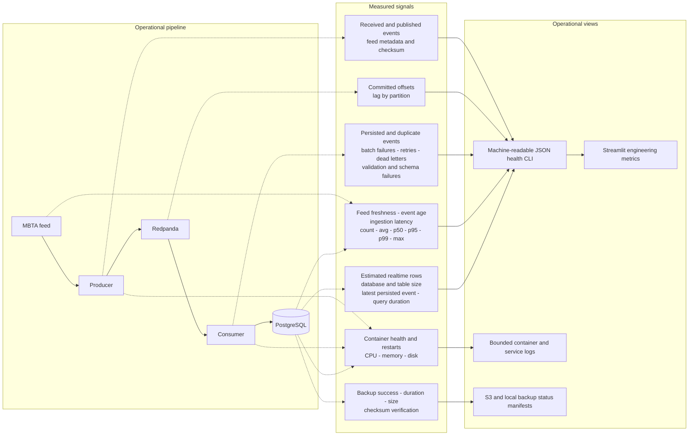
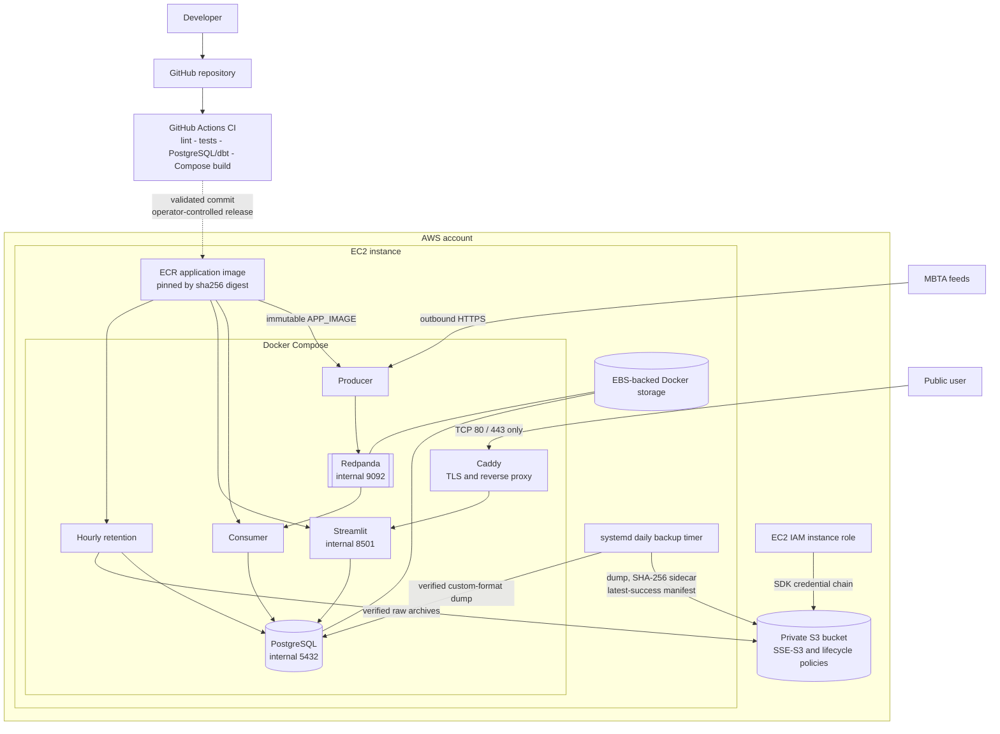

# MBTA Real-Time Transit Data Platform

Production-deployed transit data platform that combines MBTA GTFS schedules and
GTFS-Realtime vehicle positions in a streaming PostgreSQL analytics system.

[](https://github.com/rahulrb99/transit-data-platform/actions/workflows/ci.yml)


**[Live production dashboard](https://mbtatransit.xyz)**

## Overview

This repository is an end-to-end data engineering system, not a standalone ETL
notebook. It preserves raw MBTA feeds, decouples realtime collection from persistence
with Redpanda, writes validated events to PostgreSQL with at-least-once semantics, builds
analytical models with dbt, and serves a live Boston-area vehicle map through Streamlit.

The production stack runs on one AWS EC2 instance using Docker Compose. Caddy terminates
HTTPS, EBS-backed Docker volumes retain operational state, an EC2 IAM role authorizes
encrypted S3 archives and backups, and a systemd timer runs the PostgreSQL backup workflow.



The primary realtime path is emphasized from the MBTA feed through the broker,
consumer, validation and PostgreSQL. Archival, transformation, presentation and
operational controls remain separate from the event-processing transaction.

## Production Snapshot

| Streaming | Reliability | Latency | Storage and reference data |
| --- | --- | --- | --- |
| **12,495,172** events received | **100%** processing success | **1.71 s** p50 ingestion latency | **~8.1 GB** PostgreSQL database |
| **12,495,172** events persisted | **0** failed batches | **2.73 s** p95 ingestion latency | **~7.26 GB** realtime table |
| **1,068 events/min** current rate | **0** retries | **2.73 s** p99 ingestion latency | **400** routes / **10,309** stops |
| **3,133 events/min** observed peak | **0** dead letters / invalid records | **17.25 s** realtime freshness | **189,398** trips / **5,174,011** stop times |
| **0 lag** across 3 partitions | **0** missing IDs / schema failures | **0.285 s** metrics query | **194** calendar / **157** exception records |

> Point-in-time production snapshot captured 2026-09-07. Values are operational
> observations, not formal benchmarks or SLAs. Event totals cover retained metrics
> history and are not presented as lifetime or daily throughput.

Production image at capture time:
`sha256:443c5c0129a9d9af98abb06d02a3ad741c85f2af1874c88881d572c8bc6fdd35`.

## Data Pipeline

### Static GTFS ingestion

The static loader downloads the MBTA GTFS ZIP, preserves the original artifact, records
its source, ingestion timestamp, row counts and SHA-256 checksum, then stages a complete
feed before atomically activating the `raw` tables. A failed load leaves the prior static
snapshot available.

### Real-time data pipeline

The producer polls MBTA `VehiclePositions.pb` every 15 seconds by default, reuses its HTTP
session, parses protobuf records into stable JSON events, and publishes them to a
three-partition `vehicle_positions` topic. The original protobuf payload is retained for
later archive processing.



Automatic offset commits and offset storage are disabled. Valid rows and their metrics
commit together before Kafka offsets advance. Replays are safe because `event_id` is
unique and inserts use `ON CONFLICT DO NOTHING`; this is deliberately described as
at-least-once processing with idempotent persistence, not exactly-once delivery.

### Transformation and analytics

dbt models the stored data through four logical layers:

```text
PostgreSQL raw/public sources
        -> staging
        -> intermediate schedule and feature models
        -> dimensional marts and ML training dataset
```

The realtime staging and ML training relations are incremental. The project includes a
four-stops-ahead delay training dataset, but it does not train or deploy an ML model.
The Streamlit dashboard reads operational/static PostgreSQL data directly rather than
placing dbt in the live ingestion path.

## Reliability & Observability



Observability is derived from the same transactional records as the pipeline rather
than from per-event logging. Queries use retention windows, a 25,000-row latency scan
bound, PostgreSQL statistics for table scale, a 10-second statement timeout, and a
60-second dashboard cache.

The time signals answer different questions:

| Signal | Meaning |
| --- | --- |
| **Feed freshness** | Current UTC time minus the newest MBTA source timestamp. |
| **Event age** | Snapshot time minus the vehicle timestamp, falling back to feed time. |
| **Ingestion latency** | PostgreSQL ingestion time minus MBTA feed generation time. |

Invalid, missing, future, or implausibly old timestamps are excluded rather than replaced
with zero. Consumer lag is point-in-time broker state. Restart counts are point-in-time
Docker state, and metrics totals cover the configured retention window rather than the
lifetime of the deployment.

Human-readable and JSON snapshots are available from the running application image:

```bash
docker compose --env-file .env.prod -f docker-compose.yml -f docker-compose.prod.yml \
  exec -T consumer python -m ingestion.realtime.health

docker compose --env-file .env.prod -f docker-compose.yml -f docker-compose.prod.yml \
  exec -T consumer python -m ingestion.realtime.health --json
```

See [Production metrics](docs/production-metrics.md) for definitions, windows,
limitations and baseline collection commands.

## Data Model

| Layer | Relations | Purpose |
| --- | --- | --- |
| `raw` | `agency`, `routes`, `stops`, `trips`, `stop_times`, `calendar`, `calendar_dates` | Atomically activated GTFS reference data. |
| `raw` | `ingestion_metadata`, `static_load_history` | Source, checksum, archive path and load-manifest history. |
| `public` | `realtime_vehicle_positions` | Parsed vehicle observations with event, trip, stop, position and source timestamps. |
| `public` | `realtime_vehicle_position_dead_letters` | Idempotent rejected Kafka records and diagnostic context. |
| `public` | `realtime_pipeline_metrics` | Transaction-aligned batch, duplicate, retry, failure and timing metrics. |
| dbt staging | `stg_routes`, `stg_stops`, `stg_trips`, `stg_stop_times`, `stg_realtime_vehicle_positions` | Typed, consistently named source models. |
| dbt intermediate | `int_trip_stop_times`, `int_delay_prediction_features` | Schedule joins and leakage-aware feature engineering. |
| dbt marts | `dim_route`, `dim_stop`, `fct_stop_arrival`, `ml_delay_training` | Analytical dimensions, schedule facts and supervised-learning rows. |

Versioned migrations are serialized with a PostgreSQL advisory lock, executed in a
transaction, and protected by checksums and a lock timeout. Existing deployments advance
through `infrastructure/postgres/migrations`; `init.sql` initializes only empty volumes.

## Dashboard

The Streamlit dashboard provides:

- A Boston-centered live vehicle map with route, destination, vehicle, status and update details.
- Automatic refresh with stale-data and database-connectivity states kept separate.
- Current vehicles, route filtering and the 25 newest observations.
- Static route, stop, trip and scheduled-arrival counts.
- Ingestion rate, peak rate, p95 latency and consumer processing success.

Map queries scan a bounded recent-observation window, reject invalid coordinates and hide
vehicles older than the configured maximum age. The dashboard never calls MBTA directly
and does not present VehiclePositions as authoritative delay or on-time data.

> Add dashboard screenshot here.

## Production Deployment



The application services share one digest-pinned image. PostgreSQL, Redpanda and
Streamlit have no production host bindings; only Caddy publishes ports 80 and 443.
The deployment workflow in this repository currently validates inputs and documents the
OIDC/ECR/SSM plan but intentionally does not mutate AWS, so image publication and host
rollout remain operator-controlled.

Current deployment image at the 2026-09-07 snapshot:

```text
sha256:443c5c0129a9d9af98abb06d02a3ad741c85f2af1874c88881d572c8bc6fdd35
```

See the [AWS deployment runbook](docs/aws-deployment-runbook.md) for environment
validation, immutable-image rollout and health-check commands.

## Backup & Disaster Recovery

The host systemd timer schedules a daily PostgreSQL backup at 03:15 UTC with up to 30
minutes of randomized delay. The workflow:

1. Streams a PostgreSQL custom-format dump to a temporary file.
2. Validates the dump with `pg_restore --list` and computes a SHA-256 checksum.
3. Uploads the dump and checksum sidecar to S3 using explicit SSE-S3 (`AES256`).
4. Verifies uploaded size, metadata, checksum and encryption with `HeadObject`.
5. Publishes `latest-success.json` only after successful verification.

Failed uploads remain visible and retain the local dump for diagnosis. Restore validation
requires a new lower-case database ending in `_restore`, verifies the sidecar, and performs
a single-transaction restore without replacing the working database. These controls support
recovery testing; they do not constitute a zero-loss recovery guarantee.

Detailed procedures: [Backup and restore](docs/backup-restore.md) and
[S3 archive design](docs/s3-backup-archive.md).

## Security

- Production configuration requires an immutable ECR digest and rejects placeholders,
  development mode and stored AWS access keys.
- Secrets are supplied through an untracked, mode-`0600` `.env.prod`; no credentials are
  embedded in images or source.
- Boto3 uses the EC2 instance profile through the normal AWS SDK credential provider chain.
- S3 permissions are prefix-scoped, uploads request SSE-S3, and the runbook requires Block
  Public Access, TLS-only access and rejection of unencrypted writes.
- PostgreSQL, Redpanda, Streamlit and the optional Redpanda console have no public
  production bindings. Caddy is the only public ingress and adds TLS and security headers.
- The runbook recommends SSM Session Manager with no inbound SSH. If SSH is unavoidable,
  it restricts port 22 to a named administrator IP range.
- Backup files use a restrictive systemd umask, and restore tooling refuses the active
  database and existing restore targets.

## CI/CD & Testing

The primary GitHub Actions workflow runs four independent contracts:

| Job | Validation |
| --- | --- |
| **Lint** | Python 3.11 dependency installation and Ruff. |
| **Host backup on Python 3.9** | Amazon Linux-compatible operations dependencies and backup CLI imports. |
| **Tests, PostgreSQL, and dbt** | Deterministic PostgreSQL fixture, pytest integration tests, `dbt parse` and `dbt build`. |
| **Compose contracts** | Development/production Compose rendering and shared application image build. |

Tests cover producer retries and shutdown, consumer offsets and replay behavior,
idempotency, dead letters, migrations, atomic static loads, retention, backup verification,
S3 failure handling, dashboard queries, production configuration and metrics calculations.
External MBTA and AWS calls use fakes in tests.

The separate production workflow is currently a non-mutating deployment plan. Automated
OIDC authentication, ECR publication and SSM rollout remain future release work.

## Engineering Decisions & Tradeoffs

| Decision | Rationale and tradeoff |
| --- | --- |
| **Redpanda/Kafka** | Decouples MBTA polling from PostgreSQL availability and provides bounded replay. A single broker is operationally simple but not highly available. |
| **Batched persistence** | Reduces transaction overhead and commits offsets only after durable writes. Larger batches improve throughput but increase replay size after interruption. |
| **At-least-once + idempotency** | Manual commits and unique event IDs make replay safe without claiming exactly-once behavior. Duplicate attempts remain observable. |
| **PostgreSQL** | Keeps operational, reference and analytical data in one inspectable system. It is appropriate at the current scale but requires storage, WAL and vacuum monitoring. |
| **dbt** | Keeps transformations, tests, lineage and feature logic in SQL. It is a batch layer and is intentionally outside the realtime write path. |
| **Docker Compose on EC2** | Fits a small-user, single-host deployment with low operational overhead. It does not provide multi-host failover or rolling orchestration. |
| **Immutable ECR images** | Makes the deployed artifact identifiable and rollback-oriented. Publication and rollout are currently operator-controlled. |
| **S3 archive and backup** | Moves recoverable artifacts off-host with verification and lifecycle controls. Recovery confidence still depends on regular restore drills. |

## Local Development

Prerequisites: Docker Desktop or Docker Engine with Compose, Git, and Python 3.11 for
host-side development commands.

```bash
cp .env.example .env
# Set POSTGRES_PASSWORD in .env before startup.
docker compose --env-file .env up -d --build
docker compose --env-file .env ps
```

Open <http://localhost:8501>. Development exposes PostgreSQL, Redpanda, Streamlit and the
optional console on loopback only, not on all interfaces.

Install the development environment:

```bash
python -m venv .venv
source .venv/bin/activate
python -m pip install -e ".[dev]"
ruff check .
pytest
dbt parse --project-dir dbt --profiles-dir dbt
dbt build --project-dir dbt --profiles-dir dbt
```

Windows PowerShell activation:

```powershell
python -m venv .venv
.\.venv\Scripts\Activate.ps1
python -m pip install -e ".[dev]"
```

Load the static feed and inspect streaming services:

```bash
python -m ingestion.static.download_mbta_gtfs
docker compose logs --tail 50 producer consumer
docker compose exec producer python -m ingestion.realtime.producer --once
```

The normal Compose producer already runs continuously; the final command is an optional
smoke pull and may produce events that are deduplicated downstream.

## Project Structure

```text
transit-data-platform/
|-- dashboard/                 Streamlit application and live map
|-- dags/                      Optional static-ingestion Airflow DAG
|-- dbt/
|   |-- models/staging/        Typed source models
|   |-- models/intermediate/   Schedule joins and feature engineering
|   `-- models/marts/          Dimensions, facts and ML training rows
|-- docs/                      Architecture, operations and recovery runbooks
|-- infrastructure/
|   |-- caddy/                 HTTPS reverse-proxy configuration
|   |-- postgres/              Initial schema and versioned migrations
|   `-- systemd/               Daily PostgreSQL backup service and timer
|-- ingestion/
|   |-- realtime/              Producer, consumer, persistence and observability
|   `-- static/                Static GTFS download and atomic loading
|-- scripts/                   Migration, backup, restore and health tooling
|-- tests/                     Unit, contract and PostgreSQL integration tests
|-- docker-compose.yml         Local runtime
`-- docker-compose.prod.yml    Production hardening overlay
```

## Production Metrics

[Production metrics](docs/production-metrics.md) documents each metric's unit,
calculation, retention window, limitations and exact baseline commands. Production
snapshots should always include a capture date and should not be represented as SLAs,
lifetime totals or sustained benchmarks without a measured observation window.

## Roadmap / Future Improvements

- Collect and compare longer 24-hour and 7-day production observation windows.
- Add off-host notifications for stale ingestion, sustained lag, backup failure and disk pressure.
- Complete the reviewed GitHub OIDC, ECR and SSM deployment executor.
- Run scheduled restore drills and record recovery-time evidence.
- Evaluate partitioning or horizontal scaling only after production measurements justify it.
- Add GTFS-Realtime TripUpdates before training a defensible downstream-delay model.
