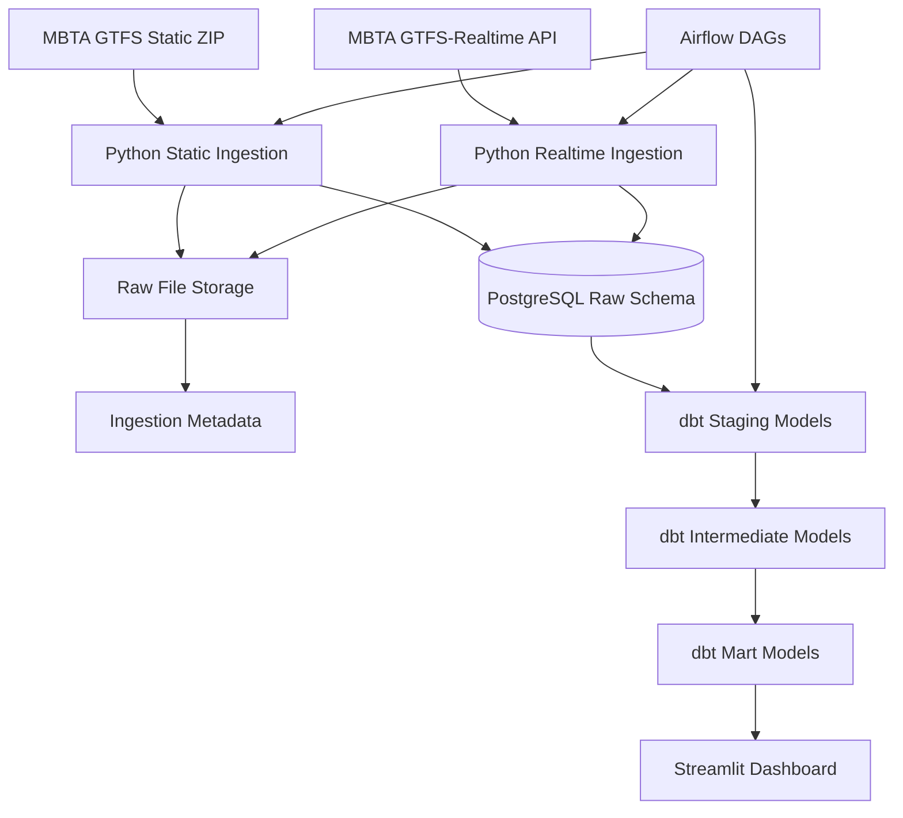

# Architecture

## Design Notes

- Raw GTFS files are preserved before transformation so pipeline outputs can be reproduced.
- PostgreSQL is used as the local warehouse for raw and modeled data.
- dbt owns analytical transformations, tests, and documentation.
- Airflow coordinates scheduled ingestion and transformation work.
- Realtime ingestion starts as direct polling; Kafka or Redpanda can be added after the core data path works.

